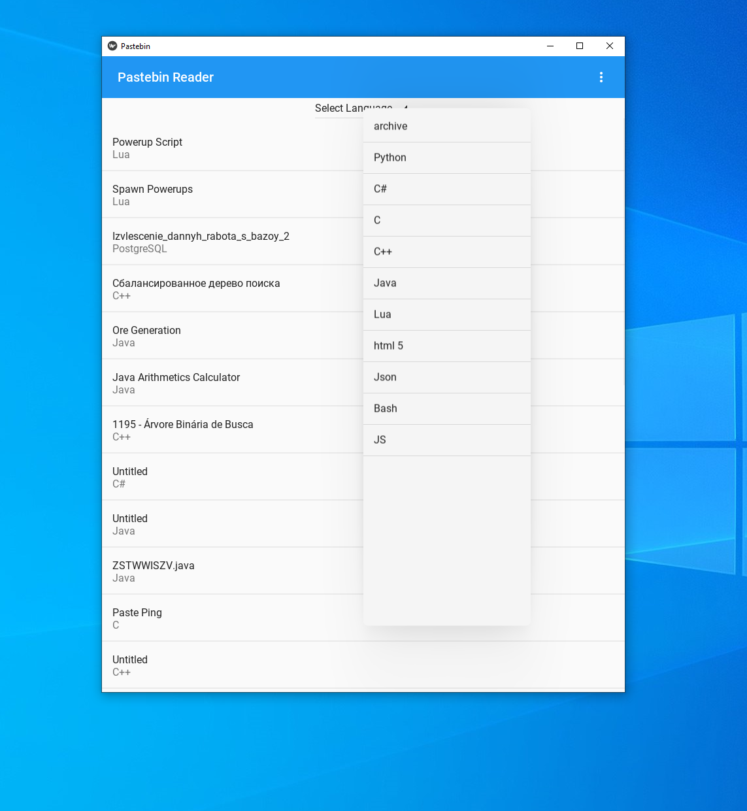

# Pastebin Reader

### Description

 Andriod app to view content from pastebin.com

### License
GPLv3 - [read here](https://github.com/Frankmau5/Pastebin-Reader/blob/main/LICENSE)

### Install

#### For Android
Download the apk file and install the apk on your device

[HERE](https://github.com/Frankmau5/Pastebin-Reader/releases/download/0.4/pastebinReader-v0.4.apk)

#### For Windows, Mac & Linux

clone project and go to the src folder.
run the requirements.txt file with pip

`pip install -r requirements.txt`

then just double click on the main.py or run 

`python main.py`

In a Terminal